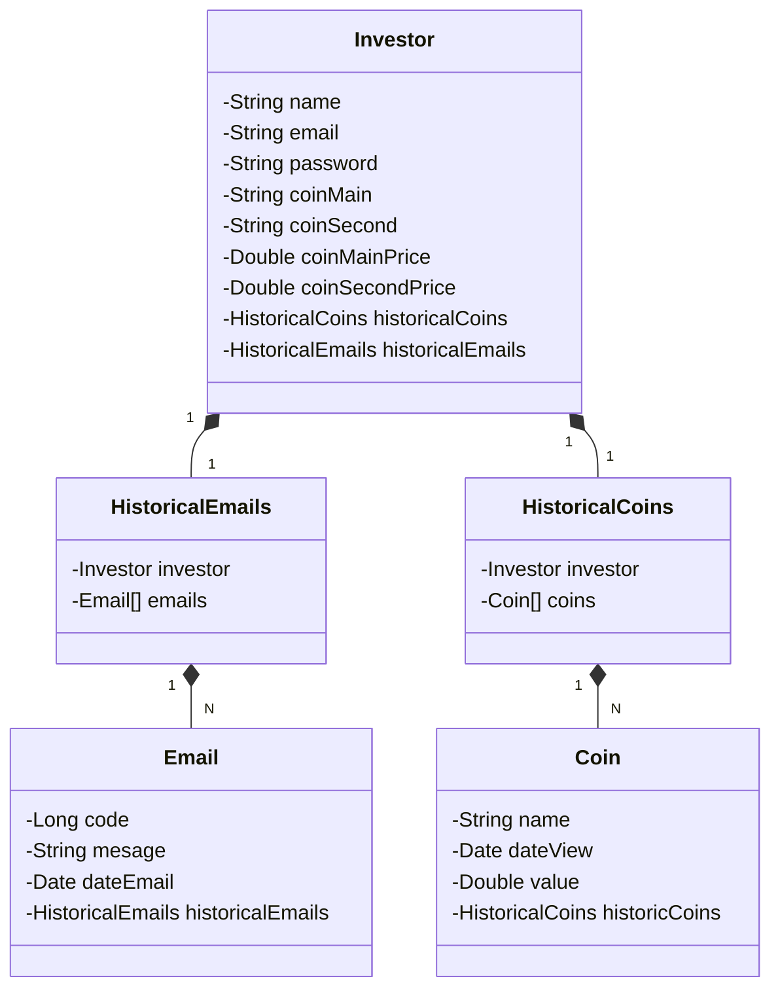

# API Compare Coins
## An API with the objective to compare two coins. Every day, one email will be sent to the user showing the relation between the coins. Also, it's possible to view the historical data of coins and historical emails on the API.
### Technologies used:
- Spring Framework
- Kotlin
- H2 DataBase
- Postgress
- Railway
## Public API used: awesomeapi
`https://docs.awesomeapi.com.br/api-de-moedas`
### Class Diagram

## Documentation API using Swagger

  

## Link deploy API: **[Deploy](https://api-compare-coin-prod.up.railway.app/swagger-ui/index.html)**

